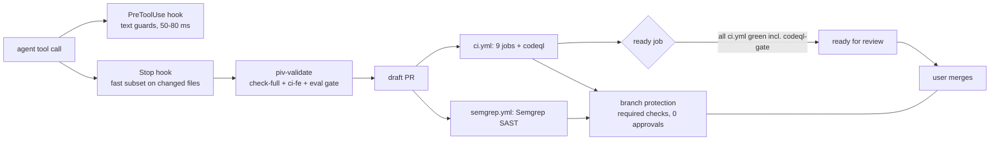

# Architecture — email-hub AI layer

Intent / job: [ai-layer-import.md](./ai-layer-import.md) (steps S0–S9, decisions D1–D11, progress log §7).
Status: approved decisions recorded 2026-09-27. Claims are tagged `observed` (a run or a file read on this date), `derived` or `expected`. Fact-checked the same day by a cold-context agent (34 claims verified; its corrections are applied below).

ID scheme: D1–D11 are the job's decisions (job §2; D11 added here). V1–V7 are the deviations the user approved in chat on 2026-09-27 (job §7 log): V1 hook on plain `python3`, V2 `Monitor` matcher, V3 fence `.semgrepignore` + `settings.local.json`, V4 `chore(wip):`, V5 S7 pick at the S7 ⏸, V6 C7 proof in S9, V7 rules `globs:` → `paths:`.

## Problem & goals

Agents already do most email-hub work (converter tracks F/G, 13+ PRs since July), and the repo has no guardrails beyond a Bash-only hook pair and a local `no-commit-to-branch` pre-commit hook. `main` is unprotected (`observed`: `gh api …/branches/main/protection` → 404). The goal is an AI layer derived for email-hub, not copied from taxi. The layer must:

- never compromise the DB or secrets;
- wire every "done" claim to email-hub's real gates;
- end each loop in a reviewed, CI-green draft PR that only the user merges;
- improve itself from its own execution reports.

Every decision below is judged against three things: the safety of the DB and secrets, evidence that is real, and the user staying in control of merges.

## Approaches considered

| Approach | Shape | Trade-off | Verdict |
|---|---|---|---|
| **A. Verbatim taxi port** (study-tutor style) | Copy `.claude/` wholesale, fix what breaks | Fastest. The study-tutor port left dangling `references/` links and pnpm leftovers; taxi's hook guard 3 fences the entire `app/` backend; `record-gate.sh` exits "GATE SHORT" on a green `make check-full` | Rejected by the user ("will not really apply AI layer") |
| **B. Derive from taxi + email-hub evidence** | Import the PIV skeleton, adapt every coupling, derive rules from the code, add email-hub-only skills from recurring PR patterns | More work per file; every adaptation needs a probe or a cite check | **Chosen** |
| **C. Fresh build from the course methodology** | Write rules, skills and hooks from scratch | No taxi debt, but it throws away a PIV chain that already ran end-to-end in taxi, and it re-learns taxi's gate lessons (#165: draft flow, merge block) | Rejected |

## Recommended approach

The layer has four layers of control. Each one catches what the layer before it cannot see:



The layers, in the order a change passes through them:

1. **PreToolUse hook** (`.claude/hooks/pre_tool_use.py`, V1: plain `python3`, stdlib only, 3.9-compatible). It guards secrets, destructive DB commands, PR state changes, finding suppressions, gate-settings writes and its own fence. It fails open and reads only command text, so it makes the wrong move deliberate rather than impossible.
2. **Stop hook** (S6). It runs ruff, mypy, pyright and the nearest pytest on files changed since the session started (D1/D2), and `pnpm type-check` for `cms/` changes.
3. **piv-validate** (S6) runs the real Definition of Done gate: `make check-full` for the backend, `make ci-fe` for the frontend, plus the eval gate when the diff touches agents or judges. It fails if the tree changed during the run. `make test` rewrites `skill-versions.yaml` dates (`observed`), and `make lint` runs `--fix` + `format` (`derived` from Makefile:129-131).
4. **CI and branch protection.** CI is authoritative, and the `ready` job flips a draft to ready. Branch protection is the backstop. Because the gh user owns the repo, a session could lift it through `gh api`. The hook blocks writes to protection, rulesets and code-scanning setup by their text, so lifting it would have to be deliberate.

The workflow is the PIV skill chain in `.claude/skills/` (plan → implement → validate → commit → draft PR → review). The existing `.claude/commands/` (be-\*, fe-\*) stay (D5), and CLAUDE.md names PIV as the default path.

## Key decisions

**Stack & libraries**
- Hooks are Python stdlib only, run as `python3` from the hook's PATH. That is the pyenv shim → 3.12.0 in a terminal session, or `/usr/bin/python3` 3.9.6 without it. Both block identically (`observed`). Latency is about 52 ms on 3.12 and about 78 ms on 3.9 (`observed` by the fact-check). uv was rejected because a failing uv exits 2, which blocks every tool (`observed`).
- `block-dangerous.sh` and `pre-commit-security.sh` stay unchanged, alongside the new hook.
- Gates reuse the existing `make` targets. No new test tooling.
- MCP: jdocmunch/jcodemunch stay machine-local. `.mcp.json` is committed only if jdocmunch installs from PyPI (D7 of the job).

**Data model (artefacts, not DB)**
- Plans live in `.agents/plans/` (700-line cap), reports in `.claude/reports/`, PR reviews in `.claude/code-reviews/`, execution reports in `.claude/execution-reports/`, and evolution reviews plus `REMEDY-LEDGER.md` in `.claude/system-reviews/`.
- Gate evidence goes to `.claude/last-gate.json`, which is gitignored and written by `record-gate.sh`.
- Session snapshots go to `.claude/state/`, which is gitignored.
- The open-gap ledger stays `.agents/deferred-items.json`, and the layer extends it rather than adding a second ledger.

**Boundaries & contracts**
- **DB.** The native Postgres is shared by every checkout and worktree. The agent may run `alembic upgrade` only. Downgrade, squash, `dropdb`, `TRUNCATE`, `docker compose down/rm -v` and volume removal are blocked (working principle "DB: upgrade only").
- **Secrets.** `.env*` reads are blocked. Committed templates are allowed, and so is one bare `cp …/.env <worktree>/.env` segment.
- **PR state.** The agent opens only draft PRs. `gh pr ready`, `gh pr merge` (including `--auto`) and their REST/GraphQL equivalents are blocked for the agent: `pulls/N/merge`, `mergePullRequest`, `enablePullRequestAutoMerge`, and the ready/draft mutations (`observed`).
- **CI `ready` job** (PR B, `expected` until written). It will `needs` all 9 ci.yml jobs plus `codeql`, act only on non-Dependabot PRs, and fail closed. Taxi's job authenticates with a `PR_READY_TOKEN` secret, not `github.token` (`observed` taxi ci.yml:164). Which token email-hub needs is settled when PR B is written. Semgrep sits in a separate workflow that a `needs` cannot reach, so it is covered by branch protection instead. Known gap: a PR can show "ready" while Semgrep is still red, but it cannot merge while Semgrep is red.
- **CodeQL, the taxi full check (D11, PR B, `expected` until written).** Everything below ports taxi's setup at f2cc6c4:
  - A `codeql` job in ci.yml runs on push to `main` and on PRs. Languages are `python` and `javascript-typescript`, plus `actions`, so the default setup's coverage is kept. It uses `build-mode: none`, `queries: security-extended` (not `security-and-quality`) and `upload: always`. `paths-ignore` covers build outputs (`node_modules`, `.next`, `dist`, `coverage`).
  - On PRs, `.github/scripts/codeql-gate.sh` (taxi, 226 lines) fails when the PR adds a high/critical or `error` alert that the base branch does not carry. A PR ref that was never analysed is red, not green. A stacked PR falls back to comparing against `main`, and the existing backlog is carried along rather than blocking.
  - The GitHub default setup is switched off, because GitHub rejects advanced-setup SARIF while it is on. The user applies that repo setting at S8.
  - The email-hub repo is public (memory, 2026-06-14), so code scanning is free.
- **Branch protection (D10).**
  - A PR is required, and admins are included, so there are no direct pushes to `main`.
  - 0 approvals are required. An approval rule would block the user's own PRs (the author cannot approve) and Dependabot's auto-merge.
  - The required checks are the ci.yml job names, `CodeQL (analyze + gate)` from the `codeql` job (renamed at S8: GitHub's own code-scanning check is also called `CodeQL`, from app `github-advanced-security`, so Actions checks are pinned to app_id 15368), and `Semgrep SAST`. The SARIF upload also shows up as a separate `Semgrep OSS` check. Decide at S8 whether it is required.
  - The exact `gh api` call is shown to the user at S8. The user runs it, and the hook blocks the agent from doing so.
  - Risk (`expected`): `semgrep.yml` skips lockfile-only PRs. With `Semgrep SAST` required, such a Dependabot PR would never get the check and auto-merge would stall. It has not happened yet (#350/#351/#366 also touched manifests). Mitigation options are listed under Open questions.
- **Code scanning.**
  - Semgrep uploads SARIF today (`semgrep.yml`). CodeQL default setup currently scans only `actions` (`observed`), and D11 replaces it with the ci.yml job above.
  - The agent never dismisses alerts or adds `nosem`/`nosemgrep`/`lgtm[…]`/`codeql[…]` suppression comments. The hook enforces this, and a human's dismissal in the GitHub UI is honoured by `codeql-gate.sh`.
  - `.semgrepignore` and the workflows are fenced from agent edits.

**Other**
- **Fence ordering.** Once the hook is live, `.github/workflows/` and `.claude/hooks/` can be changed only through a Bash heredoc or by the user. PR B is written from a session where the new hook is not yet active.
- **Rules loading.** `.claude/rules/*.md` use `paths:`, so the backend, frontend and testing rules load only when matching files are read (V7).

## Email-hub skill set (S7 candidates — final pick at the S7 checkpoint)

| Candidate | Recommendation | Evidence |
|---|---|---|
| `converter-fix` | Keep | 9 code design-sync PRs in #352–#365 (10 including docs-only #364) share the fix → A3 re-score → snapshot cycle, according to the S7 scan. That claim is `derived` from PR bodies and not re-verified. A3 jitter rules live only in memory today |
| `deferred-items` | Keep, scoped to add, close and SHA-stamp | 26 `pending` placeholders on main; #355 was a whole PR of stamping. Lookup stays in `/preflight-check` step 2 |
| `eval-gate` | Fold into piv-validate as a conditional branch | No eval PRs in the window; `.claude/docs/eval-system-guide.md` exists |
| `email-html-check` | Drop and move the rules into the `code-reviewer` agent | No incidents; golden conformance already enforces them |
| Base-branch check | Add to piv-create-pr and piv-review-pr | #358/#361 merged into already-merged branches and had to be re-landed |

## Missing pieces

- The adapted PIV skills (S5/S6): piv-validate, piv-create-pr + `record-gate.sh` parser, piv-implement (`chore(wip):`), piv-plan-implementation, the `code-reviewer` agent, and `stop_check.py`.
- `.claude/references/conventions.md` (§commit/§pr/§review) and `logging-standard.md`.
- PR B, the CI changes: the `codeql` job, `codeql-gate.sh`, and the `ready` job with its token (D11/D3). Then the repo settings the user applies: default setup off, and branch protection (D10).
- An `epic` GitHub label, for piv-next and piv-slice-epic (D9). `next.sh:31` row format ≠ the piv-slice-epic template (a latent bug inherited from taxi).
- `PORTED-FROM-TAXI.md`, which records the source commit and an adaptation table.

## Spikes & experiments

The main spike checks that the `ready` job behaves as described:

```
Question:      does the ready job flip correctly and stay out of Dependabot's way?
Spike:         PR B opened as a draft carries the job itself; push one red commit, then a green one, over 1 day
Decision rule: keep the job if red → stays draft and green → ready on the same head; if it flips on a stale head
               or touches a Dependabot PR, add the head-SHA recheck from taxi ci.yml before merge
```

```
Question:      does the CodeQL job fit email-hub's CI budget and give a usable baseline?
Spike:         PR B's own run — time the codeql job (python + JS/TS on ~4k files) and read the open-alert
               backlog on the first push-to-main analysis
Decision rule: keep security-extended if the job finishes within the slowest existing job (e2e-smoke,
               20-min timeout); if it is far slower, narrow paths-ignore (e.g. tests, services/*/node_modules)
               before merging. The backlog never blocks: the gate only diffs new alerts
```

Two things are measured rather than spiked:
- **Stop hook cost.** The ~15 s/module figure from the audit is `expected` for this repo until S6 measures it on email-hub. If it exceeds 60 s on a typical diff, narrow it to ruff + mypy only.
- **Hook firing (C7).** Piped JSON has proven the script's logic. S9 proves the hook fires in a real session started in the worktree, using harmless text probes only.

## Open questions

- **Retiring `.claude/commands/`.** Two workflow systems can drift apart. This is settled after the S9 loop proves PIV on a real ticket (handoff T1).
- **Lockfile-only Dependabot PRs vs a required `Semgrep SAST`.** There are three options. Accept the risk and merge those PRs by hand if one stalls. Remove the lockfile skip from `semgrep.yml`. Or leave Semgrep off the required list, since CodeQL is then the gating scanner. This is decided at S8 with the protection call.
- **Stale header in `dependabot-auto-merge.yml`.** It says protection is "unavailable on the current plan". Update it in PR B.
- **Semgrep inside the `ready` gate.** Revisit if a PR is ever flipped to ready while Semgrep is red and that causes confusion. The fix would be to move Semgrep into ci.yml.
- **Archon.** Out of scope (D6), with its own follow-up in the job §6.
