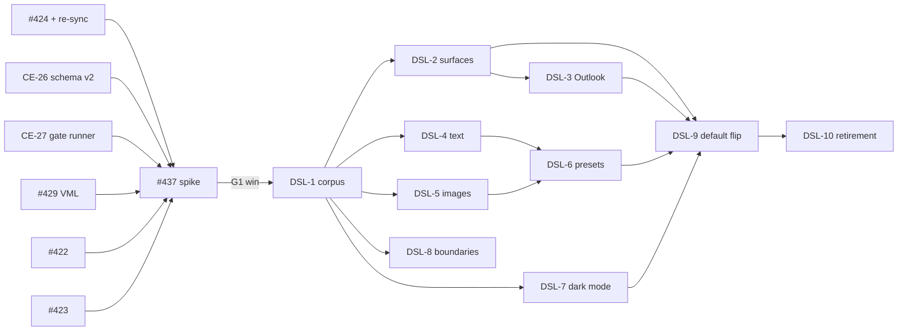

# DSL epic: ticket slices (draft, held for the spike verdict)

Status: **draft** (2026-10-02). Option O1, chosen by the user 2026-10-02: the full slice lives here, and only the verdict-independent groundwork becomes issues now. The DSL tickets (DSL-1 to DSL-10) become children of CE-20 (#438) only after CE-19 (#437) reports a "DSL wins" verdict. If the verdict is "stay on templates", this file is rewritten, not executed.
Architecture: [`docs/architecture/dsl-compiler.md`](../../docs/architecture/dsl-compiler.md) (S1–S5, FR1–FR6, M1–M8, N1–N5). Epic: #439, sliced in [`converter-epic-slices.md`](./converter-epic-slices.md); its conventions table applies to every ticket here unchanged.
Base: origin/main `d1fdcd72` (observed: `git fetch` 2026-10-02).

## Decision points: when the DSL needs more planning

The DSL plan grows only at these points. Each has an owner artefact, so the question "do we need to plan more?" always has a place where it is answered in writing.

| Code | When | What decides it | Outcome |
|---|---|---|---|
| G0 | groundwork merged (CE-6 #424 with re-sync, CE-26, CE-27, CE-11 #429) | `piv-next` shows #437 unblocked once #422 and #423 also land | start the spike |
| G1 | spike report `docs/o1-spike.md` lands | S5 verdict rule in the spec, written before scores are read | **win** → re-check this file against the report, then create DSL-1 to DSL-10 under #438. **lose** → rewrite this file; release the held template tickets |
| G2 | the spike report's re-plan trigger table (below) has any row marked "fired" | the trigger's own rule | amend the spec (`dsl-compiler.md`) first, then this file, before any DSL ticket is created |
| G3 | each DSL ticket starts | `piv-plan-implementation` on that ticket | the normal per-ticket plan; no spec change unless a G2 trigger fires mid-ticket |
| G4 | DSL-9 (default flip) is ready | full-corpus gate + held-out check + user ratification | DSL becomes the default; DSL-10 retirement can start |

### Re-plan triggers (the spike report must mark each "fired" or "not fired", with the count)

| Code | Trigger | Why it needs planning, not a ticket fix |
|---|---|---|
| T-A | FR5 (row inside a column stacked) fires on any scored section that drops beyond the margin | N4's "stack and count" decision was wrong for real designs; needs the `raw` table row or `mj-group` designed in the spec |
| T-B | FR3/FR6 (surface depth or overlap) fires on any section of either spike design | a fourth nesting level or overlap model is needed; the S2 nesting table changes |
| T-C | the held-out design fails the verdict while maap passes | the compiler is fitted to Email Love structure; boundary and tree-builder assumptions need a planning pass before slicing |
| T-D | the tree builder needed data that exists only on `EmailSection`, not on `DesignNode` | approach B's split is wrong; S5's tree-source rule changes |
| T-E | either design's HTML is over 80KB | size becomes a design constraint (S4 emitter output shape), not a lint |
| T-F | a node type outside the nine was needed to pass | S1 vocabulary changes; schema v2 changes before it is persisted widely |
| T-G | the Outlook source (CE-4 #422) contradicts the markup-inspection result for kill test 4 | the Outlook paths (DSL-3) need a different technique |

## Groundwork: create now (verdict-independent)

| Code | Issue | Title | Spec | Depends on |
|---|---|---|---|---|
| M1 | CE-6 #424 (exists) + scope addition | Read auto-layout sizing fields, and re-sync committed `structure.json` so the fields reach CI | S3, M1 | CE-1 #419 |
| CE-26 | new | Document schema v2: `body` tree beside `sections`, version dispatch in loader and validator | S1, M2 | none |
| CE-27 | new | DSL case runner into the CE-1 gate (`score_rendered_case`) with the section-id assertion | S5, M5 | CE-1 #419 |

#### CE-26: Document schema v2 and version dispatch (M2)

- **Scope:** `email-design-document-v2.json` = v1 plus `body` and the nine node `$defs` (S1). `from_json` and `validate` dispatch on `version`; `"1.0"` loads with `body=()` against the unchanged v1 file. Node dataclasses in `app/design_sync/dsl/` with `to_json`/`from_json`. No builder, no compiler, no flag.
- **Done check:** every committed v1 document round-trips byte-identically; a v2 document with a body of all nine node types round-trips; v2 with an unknown node `type` fails validation; `make check-full` green; converter output byte-identical on all cases (no behaviour change).
- **Wrong if (derived):** any v1 persisted document fails to load after the change.
- **Carries:** `phase-53.7-typography-maxitems-cap` (decide whether v2 lifts the 200 cap).

#### CE-27: DSL case runner into the CE-1 gate (M5)

- **Scope:** a runner that takes any `ConversionResult` for a case and scores it through `score_rendered_case` (`fidelity_gate.py:184`) against the committed baseline. It asserts `set(section_node_ids)` equals the baseline's node ids before scoring. Exercised with the template path's output, so it is testable before the compiler exists.
- **Done check:** running it on the template path reproduces the committed baseline for every case within jitter (0.0000 same-host per `docs/fidelity-gate.md`, not re-run here); a mismatched id set fails with a named error.
- **Wrong if (derived):** the runner's scores differ from `make fidelity-gate` on the same output.

## The spike

CE-19 (#437) builds M3 (tree builder, FR1–FR6) and M4 (compiler) for maap plus one held-out design, behind the default-off flag (N3). It depends on #419, #422, #423, #424, #429, and here also CE-26 and CE-27. Its report adds the re-plan trigger table above.

## DSL tickets (create under #438 only at G1 "win")

| Code | Title | Spec | Depends on | Absorbs |
|---|---|---|---|---|
| DSL-1 | Compiler across the full corpus: all seven cases through the DSL path, every FR rule's count reported | S2, S4 | #437 | |
| DSL-2 | Buttons and surfaces: VML buttons (CE-11 builder), card-on-band, column cards, radius/stroke | S2, S3 | DSL-1, #429 | |
| DSL-3 | Outlook paths: new-Outlook column widths repeated in body styles, VML section backgrounds | S3 | DSL-2, #422 | |
| DSL-4 | Text: font stacks, style runs, roles | S1, S3 | DSL-1 | #425, #432 (rewritten as compiler work) |
| DSL-5 | Images: alt, href, sizing, fluid on mobile, icon vs content image | S1, S3 | DSL-1 | #427 compiler half, #428 lessons |
| DSL-6 | Presets: social, header, footer with unsubscribe (CE-2 content checks pass on DSL output) | S1 | DSL-4, DSL-5 | |
| DSL-7 | Dark mode on DSL output (reuse `_build_dark_mode_css`) | S4 | DSL-1 | |
| DSL-8 | Section-boundary step behind a flag (Jev/VLM), held-out scored | S5 | DSL-1, #423, #433 | #436 (rewritten) |
| DSL-9 | Default flip: DSL path default for new imports (G4) | S4 | DSL-2 to DSL-7 | |
| DSL-10 | Template retirement, one template at a time, only where a preset covers it and its per-section score holds | none | DSL-9 | closes #426, #430, #431, #435 |

Size budget (80KB warn, 102KB fail) is part of DSL-1's done check, reusing CE-23 (#442)'s size check rather than a ticket of its own.

## DSL-specific conventions (in addition to the epic table)

| Rule | Applies to |
|---|---|
| `compile_tree` stays pure; a byte-determinism test covers every new emitter | every DSL ticket |
| Every flattening or drop emits a warning code; the ticket's report counts codes per case | every DSL ticket |
| No document is half-compiled and completed by templates | every DSL ticket |
| A change to node vocabulary, nesting or value contracts amends `dsl-compiler.md` first (G2) | every DSL ticket |

## If the verdict is "stay on templates" (G1 lose)

Release #426, #430, #431, #435 from hold; keep #425, #427, #432, #436 at their current template scope; CE-20 (#438) is scoped as the T8 residual it was. CE-26 and CE-27 stay merged: the v2 loader is inert without a body, and the runner scores any path.
