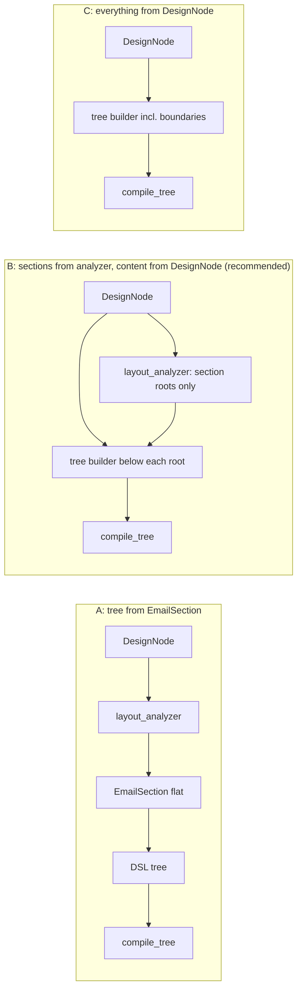

# Architecture: DSL node tree compiled to MJML

Status: **proposed** (2026-10-02). Decisions N1–N5 answered by the user 2026-10-02, all as recommended. No code written against it.
Slices: [`.agents/plans/dsl-epic-slices.md`](../../.agents/plans/dsl-epic-slices.md).
Intent: epic #439 (converter fidelity), sliced in [`.agents/plans/converter-epic-slices.md`](../../.agents/plans/converter-epic-slices.md). This doc is the pre-spike spec for CE-19 (#437) and the input for slicing CE-20 (#438).
Base: origin/main `35d82942` (observed: `git fetch` 2026-10-02). Code refs are at that SHA.

## Problem & goals

The converter fills ~185 fixed HTML templates from a section-flat document (`EmailDesignDocument`: section → column → typed lists). Figma structure deeper than that is flattened before any template sees it, so styling (surfaces, widths, padding, radius) is lost upstream of the templates. The proposal is a small layout DSL (a typed node tree) that a pure compiler turns into MJML, which the existing sidecar compiles to HTML. The goal is that spike #437's emitter becomes the first slice of the real compiler rather than throwaway code. Every decision below is judged by whether it lets the spike answer one question honestly: does compiling from structure beat template filling on the per-section fidelity gate (CE-1)?

## Approaches considered

The approaches differ in where the tree comes from. The compiler is the same in all three.



| | A: from `EmailSection` | B: hybrid (recommended) | C: all from `DesignNode` |
|---|---|---|---|
| Cost | lowest | medium | highest |
| Tests the flattening problem | no: inherits it, so a poor score proves nothing | yes, below the section boundary | yes, including boundaries |
| CE-1 gate works unchanged | yes | yes: section ids match the baseline | no: new section roots → "lost/new section" failures regardless of fidelity |
| Variables changed at once | one (emitter) | one (content structure) | two (boundaries and structure) |

**Recommendation: B.** Section roots are the analyser's boundary decision (owned by CE-18 #436, out of this spike). Everything under a section root is built from `DesignNode`. Only one variable changes, so a score move is attributable to it, and the gate's section ids line up with the committed baseline.

## Recommended approach

`EmailDesignDocument.from_legacy` (`email_design_document.py:1518`) already has the `DesignNode` tree in scope when it runs `analyze_layout`. It gains one more step: for each analysed section, a tree builder walks that section's `DesignNode` subtree and produces typed DSL nodes into a new `body` field. The document is persisted as `email-design-document-v2`. On the MJML path, a flag-gated branch in `convert_document_mjml` (`converter_service.py:408`) calls `compile_tree(doc)`, wraps the result in the existing `_MJML_DOC` shell (`mjml_template_engine.py:212`), and compiles it through `compile_mjml` (`:1355`). That sends it to the sidecar's MJML 4.18.0 (observed: `services/maizzle-builder/package-lock.json:6652`). The result carries gate-format section markers and `section_node_ids`, so CE-1 scores it with no gate changes. New code lives in `app/design_sync/dsl/`. The name `tree_compiler` is taken by `app/components/tree_compiler.py`, a template-slot tree that this does not reuse.

## The five spec points

### S1. Node schema: `email-design-document-v2`, `body` beside `sections`

- **Shape.** `version: "2.0"` plus `body: tuple[BodyNode, ...]` next to the unchanged `sections`. Nodes are frozen dataclasses with hand-written `to_json`/`from_json`, matching the module's existing style (all types there are `@dataclass(frozen=True)`, observed). There is no Pydantic. Each node carries a `type` tag (discriminated union), `id` (the Figma node id) and `name`.
- **Vocabulary (9 nodes).** `wrapper`, `section`, `column` (containers), and `text`, `image`, `button`, `divider`, `spacer`, `raw` (leaves). `hero`, `carousel`, `accordion`, `navbar`, `table` and `social` are out of v1. Social becomes a preset, meaning a reusable subtree of these nine nodes.
- **Leaf payloads reuse v1 types verbatim.** `TextNode` wraps `DocumentText` (`:522`), `ImageNode` wraps `DocumentImage` (`:632`), and `ButtonNode` wraps `DocumentButton` (`:716`). Each adds only what the gap table lacks:
  - text: required `role` enum (`heading | body | label | cta`) and `font_stack`
  - image: `alt`, `href`, `sizing`
  - button: `align`, `sizing`
  - `divider`: thickness, colour, style, width
  - `spacer`: height, optional bg
  - `raw`: sanitised table-only payload plus a `reason` code
  - containers: background colour, `radius`, `padding`, `vertical_align`, `sizing`, `full_width`, and optional background image
- **Loader rule.**
  - Today `from_json` (`:1456`) does not check `version` and would silently drop a `body` key. The validator is pinned to the v1 file through a single-entry `lru_cache` (`:46-61`), and the v1 schema has `additionalProperties: false` with `version: {"const": "1.0"}`.
  - v2 therefore needs both to dispatch on `version`. `"1.0"` loads with `body=()` and validates against the unchanged v1 file. `"2.0"` validates against a new `email-design-document-v2.json` (v1 plus `body` and node `$defs`).
  - Persisted v1 documents keep loading through `import_service.py:239`, unchanged.
- **v1 replay on the DSL path** (N2). A replayed v1 document has no tree, and `DesignNode` is gone on the replay path. Decided: when the DSL flag is on and `body` is empty, take the existing legacy re-fetch path (`import_service.py:267`), which rebuilds the document from the live structure. Rejected: falling back to the template MJML path with a warning.

### S2. MJML-legal nesting and the flattening rules

Legal MJML 4.18.0 children, taken from `mjml-preset-core/lib/dependencies.js` (observed). The DSL is deliberately stricter:

| Parent | MJML allows | DSL allows |
|---|---|---|
| `mj-body` | raw, section, wrapper, hero | wrapper, section, raw |
| `mj-wrapper` | hero, raw, section (no wrapper) | section (≥1), raw |
| `mj-section` | column, group, raw | column (≥1), raw |
| `mj-column` | button, divider, image, raw, spacer, text, + social/table/navbar/carousel/accordion | text, image, button, divider, spacer, raw |

`mj-group` (keeps columns side by side on mobile) is out of v1 and can be added later without a schema break.

**Card placement.**
- A card on a band is `wrapper` (band: bg, padding) around `section` (card: bg, radius).
- A card inside a multi-column row is a `column` with `background-color` and `border-radius`. Use `inner-background-color` and `inner-border-radius` when the card needs padding outside it. `mj-column` has no `inner-padding`; only `mj-button` does (observed, `mjml-column/lib/index.js:321-344`).
- Classic Outlook ignores radius on sections and columns. That is the accepted degradation unless VML is injected through `mj-raw`.

**Flattening rules.** Each rule is deterministic, emits a warning code into `CompileResult.warnings`, and is counted in the spike report. Nothing is flattened silently.

| Code | Figma shape | Rule | Warning |
|---|---|---|---|
| FR1 | leaf directly under a section root | wrap it in an implicit full-width column | `dsl.implicit_column` |
| FR2 | VERTICAL auto-layout frame inside a column, no fill/stroke/radius | hoist its children into the column in order; its padding and item spacing move onto the hoisted leaves | `dsl.frame_hoisted` |
| FR3 | surface (fill, stroke or radius) at depth 3 or more (surface in column in card) | drop the innermost surface's paint, keep its children | `dsl.surface_depth_exceeded` (kill test 1 counts these) |
| FR4 | band inside band (wrapper in wrapper) | merge them; the outer becomes the wrapper, the inner paint moves to the section | `dsl.wrapper_merged` |
| FR5 | HORIZONTAL frame inside a column (row in column, e.g. icon + text) | stack its children vertically (N4) | `dsl.row_in_column_stacked` |
| FR6 | overlapping children or absolute positioning (non-auto-layout GROUP) | emit `raw` if a table-only rendering exists, else drop | `dsl.overlap` (kill test 1 counts these) |

### S3. Value contracts

All values are normalised by the tree builder. The compiler never sees a Figma value it would have to guess about.

| Value | Contract | MJML emission |
|---|---|---|
| Lengths | `int` px; the builder rounds once with `round()` | `"{n}px"` |
| Colour | lowercase six-digit `#rrggbb`. Alpha < 1 is blended against the nearest painted ancestor (or body bg) and logged `dsl.alpha_blended` | as is |
| Font stack | `tuple[str, ...]`, non-empty, last item ∈ {`serif`, `sans-serif`, `monospace`}; generic defaults to `sans-serif` when the family is unknown | names with spaces quoted, comma-joined |
| Sizing | enum `FIXED \| FILL \| HUG`, horizontal axis, from Figma `layoutSizingHorizontal` | see below |
| Padding | 4-tuple `(top, right, bottom, left)` of int px | `"Tpx Rpx Bpx Lpx"` |
| Radius | `int` or 4-tuple `(tl, tr, br, bl)` of int px (the `DocumentCornerRadiusSpec` shape, `:489`) | `border-radius` on section, column, button, image |
| Item spacing | int px; becomes `padding-top` on each following child, not a spacer node. `spacer` is only for real empty frames | padding |

**Sizing mapping.** The handoff's FIXED → px / FILL → equal % / HUG → auto needs two corrections:
- `mj-column` width accepts only px or %, so HUG → auto is illegal there.
- An equal % split is only right when every sibling is FILL.

The rule:
- **Columns always emit px.** FIXED is its own width. HUG is the measured width. FILL is `(section inner width − FIXED/HUG sibling widths − gaps) ÷ number of FILL siblings`, and the integer remainder goes to the last FILL column. MJML columns have no gap attribute, so each gap is split into the adjacent columns' left/right padding and added to their widths. Column widths therefore always sum to the section's inner width, enforced as an invariant (a `CompilationError` if broken), while the content width inside each column still equals the Figma width.
- **Leaves.**
  - image: FIXED → `width` px; FILL → no `width` (fills the column).
  - button: HUG → MJML default (auto); FILL → `width="100%"`; FIXED → px.
  - text: always fills the column.

**Prerequisite (M1).** Sizing is not captured today. `DesignNode` (`app/design_sync/protocol.py:111`) has no sizing field, and the committed `structure.json` has none. The gitignored `raw_figma.json` does (observed 2026-10-02 by grep over all seven cases; e.g. case 5 has 72 FILL / 22 FIXED / 28 HUG). Capturing it in `_parse_node` and re-syncing `structure.json` changes committed fixtures, so the ladder and snapshot byte-identity checks apply to that change even though the template path ignores the field.

### S4. Compiler interface

```
compile_tree(doc: EmailDesignDocument) -> CompileResult
CompileResult(mjml: str, warnings: tuple[DslWarning, ...], section_node_ids: tuple[str, ...])
DslWarning(code: str, node_id: str, detail: str)
```

- **Pure and deterministic.**
  - No Figma, network, filesystem or clock access. Same document in, byte-identical MJML out; a unit test asserts this.
  - Attribute order is fixed per emitter.
  - Invariant breaches (illegal nesting that reached the compiler, column widths that do not sum) raise `CompilationError`. The idea is borrowed from `app/components/tree_compiler.py`.
  - A document is never half-compiled and then completed by templates.
- **Per-node emitters.**
  - A registry maps node type to an emitter, `emit(node, ctx) -> str`.
  - `ctx` carries inherited state: available width, nearest painted ancestor colour, surface depth, and the warning sink.
  - Adding a node type means adding one emitter.
- **Section markers: the handoff's form is wrong for the gate.**
  - One marker pair per analyser section: 15 for maap, because the gate counts analysed sections, not the 13 rendered rows of the ladder. When a band wrapper holds several sections, or FR4 merges bands, the pairs sit inside the `mj-wrapper` around each inner section. Before scoring, assert `set(section_node_ids)` equals the baseline's node ids for the case.
  - The CE-1 gate (`fidelity_gate.py:368-394`) only reads paired depth-0 comments `<!-- section:section_<i> -->` … `<!-- /section:section_<i> -->`. It maps `i` to a node id through `ConversionResult.section_node_ids[i]`.
  - The `<!-- section:{id}:{type} -->` form from `mjml_template_engine.py:237` is never read by the gate. It is also stripped by the sidecar (`keepComments:false`, `mjml-compile.js:28`), so `inject_section_markers` does nothing on today's MJML path (observed by compiling with MJML 4.18.0). Its `<div>` wrapper would also break the table-only rule.
  - The compiler therefore emits the gate's pair format inside `mj-raw` around each top-level body child, and fills `section_node_ids` in marker order.
  - Observed 2026-10-02: MJML 4.18.0 with the sidecar's options keeps `mj-raw` comments as standalone comment nodes (lxml parse), and the gate's own `_SECTION_BOXES_JS` returned nonzero boxes in both placements: pairs at body level around a section and a wrapper, and pairs inside an `mj-wrapper` around two inner sections. That ran in local Chromium, not the pinned gate image.
  - `inject_section_markers` is left alone, because the template MJML path still owns it.
- **Shell and compile.** The `_MJML_DOC` head (fonts, dark-mode CSS, `mj-body width`) and `compile_mjml` are reused unchanged.
- **Image sources (N1).** A pure compiler cannot resolve asset URLs. Decided: `compile_tree(doc, *, image_urls: Mapping[str, str] = {})`, keyed by `export_node_id`, with the caller passing what the asset step resolved. It stays pure, and a missing key emits `dsl.image_unresolved`. Rejected: a placeholder token that a post-compile step rewrites.
- **Selection (N3).** Decided: a registered, default-off feature flag (`dsl_compiler_enabled`) checked inside `convert_document_mjml` when `doc.body` is non-empty. Rejected: a third `output_format` value, which widens the public `Literal["html", "mjml"]` (`import_service.py:92`) and the API schema before the spike has a verdict.

### S5. Acceptance test

- **Designs.** maap (case 5) plus one held-out design from CE-5 (#423). No held-out case exists yet (observed: `data/debug/` holds 5–10 and reframe only). Under default HD3 the spike runs on maap plus the best available non-Email-Love file, and the boundary claim stays untested. The held-out case gets a template-path baseline stamped through the add-a-case recipe (`docs/fidelity-gate.md`) before any DSL score is read; without it, verdict condition 1 holds on maap only.
- **Tree source.** The tree is built from `DesignNode` below the analyser's section roots (approach B), never from `EmailSection`. The section-identity rule follows from that: section root ids equal the analyser's, so the gate's lost/new-section checks stay meaningful.
- **Scoring.**
  - Use the committed CE-1 baseline (`data/debug/fidelity_baseline.json`; for maap, 15 sections, min 0.6528 at node 2833:1643, median 0.9875, stamped 2026-10-02 at 98355b2f; observed by reading the file, not re-run).
  - The gate's `check` is wired to `run_case_conversion`, which is the template path. The spike therefore adds a DSL runner that feeds `score_rendered_case` (`fidelity_gate.py:184`) with its own `RenderedCase`. No gate code changes.
  - Margin is 0.005 (`DEFAULT_MARGIN`, `:60`).
- **Extra checks.**
  - Byte determinism (S4).
  - MJML round trip through `MjmlImportAdapter().parse` (`mjml_import/adapter.py:20`), asserting section count and leaf counts per section. Ids do not survive the importer.
  - Column-width sum invariant on every case.
  - Generality-rule unit tests build minimal `DesignNode` trees per flattening rule (FR1–FR6).
- **Verdict rule (proposed, expected; not yet run).** The DSL wins if all of these hold:
  1. On both designs, no section is below its baseline by more than the margin.
  2. maap's worst section improves by more than the margin.
  3. All kill tests pass.
  4. The emitter contains zero design-specific branches.

  Otherwise the result is "stay on templates" with the failing condition named. Held-out scores are reported, never used to tune.
- **Kill tests** (from #437, with defaults HQ1 and HQ3 applied):
  1. A surface at depth 3 or more, or overlapping layers, needed to match the design (FR3/FR6 counts above zero on a scored section).
  2. Output over 102KB (Gmail clip). Between 80 and 102KB is a warning line, not a kill.
  3. Outlook buttons lose radius or stroke (HQ1: kept as written). This needs the CE-11 (#429) VML builder, because MJML 4.18.0 `mj-button` emits no `roundrect` (observed: grep across `node_modules/mjml-*` and a compiled sample).
  4. New Outlook stacks multi-column rows (HQ3: added). Under default HD2 this is checked by markup inspection only (column widths repeated in body styles) and marked inferred.
- **Figures in this section** are read from committed files at `35d82942` unless tagged otherwise.

## Key decisions

- **Stack & libraries.** MJML 4.18.0 via the existing sidecar. MJML 5 is blocked by Dependabot ignore (`.github/dependabot.yml:62-68`) because its async `mjml2html` breaks the sync `compileMjml`. VML for buttons and backgrounds follows the jsx-email `v:roundrect` pattern (CE-11), not `mjml-msobutton`. Python frozen dataclasses. No new dependencies.
- **Data model.** One document type, two versions; `body` (tree) sits beside `sections` (flat). `sections` stays the source for every existing consumer (template path, QA, VLM, cache keys), so v2 adds a field and changes no existing behaviour.
- **Boundaries & contracts.**
  - The pure compiler has no I/O; the sidecar HTTP call stays in `compile_mjml`.
  - `raw` payloads pass `sanitize_web_tags_for_email()` and must be table-only.
  - Text content keeps today's escaping.
  - No new secrets, services or auth surface.
- **Other.** The template path is untouched and stays the default. The DSL path is reachable only with the flag on and a v2 document. CE-1 is the single acceptance harness.

## System behaviour

- **Accumulates.**
  - Persisted v2 documents. Once written, the v2 loader is permanent.
  - Warning codes. The report must count them per case, or FR rules become silent loss.
- **Delayed feedback.** Outlook (classic and new) behaviour is invisible to the gate, which renders Chromium only. Without a render source (HD2), Outlook regressions surface only from users.
- **Bottleneck once it works.** Section boundaries (the analyser), which approach B deliberately holds fixed. The next real limit is CE-18 (#436).
- **Gaming risk.** Tuning flattening rules until maap scores well is the failure the generality rule and the held-out check exist to block. Rules key on Figma structure only, and held-out scores are never used for tuning.

## Missing pieces

| Code | Piece | Needed by |
|---|---|---|
| M1 | Capture `layoutSizingHorizontal`/`Vertical` in `DesignNode` and `_parse_node` (CE-6 #424); re-sync committed `structure.json` (proposed addition to #424; ladder and byte-identity checks apply) | S3, spike |
| M2 | v2 JSON schema; `from_json` and validator dispatch on `version` | S1 |
| M3 | Tree builder below analyser section roots (FR1–FR6) | S2, S5 |
| M4 | `app/design_sync/dsl/` compiler and emitters | S4 |
| M5 | DSL case runner into `score_rendered_case` | S5 |
| M6 | VML button builder (CE-11 #429) | kill test 3 |
| M7 | Held-out design (CE-5 #423, HD3) | S5 |
| M8 | Asset URL map passed to `compile_tree` (N1) | S4 |

## Spikes & experiments

```
Question:      Does compiling from structure beat template filling on per-section fidelity?
Spike:         CE-19 (#437): M1–M5 for maap + one held-out design, behind the default-off flag
Decision rule: slice CE-20 (#438) as the DSL epic if the S5 verdict rule holds;
               otherwise stay on templates and re-open the held template tickets
```

The spike report also marks each re-plan trigger (T-A to T-G in [`dsl-epic-slices.md`](../../.agents/plans/dsl-epic-slices.md)) fired or not; any fired trigger amends this spec before DSL tickets are created.

## Open questions

Codes prefixed H are the 2026-10-02 handoff's D2/D3/Q1/Q3, renamed because the epic plan already uses Q1–Q7 for other decisions.

| Code | Question | Epic-plan code | Default / recommendation |
|---|---|---|---|
| HD2 | Outlook render source for CE-4 (#422) | Q5 | no spend; markup inspection, marked inferred |
| HD3 | 3+ non-Email-Love Figma files for CE-5 (#423) | Q6 (answered: 3+) | maap + best available held-out; boundary claim untested |
| HQ1 | Kill test 3: fail on lost radius/stroke, or only on lost shape/clickability | none | keep as written (radius/stroke) |
| HQ3 | Add new-Outlook stacking kill test and 80KB warning line | none | add both (applied above) |

Decided 2026-10-02 (user, each as recommended):

| Code | Question | Decision |
|---|---|---|
| N1 | Image src in a pure compiler | `image_urls` keyword argument |
| N2 | DSL flag on, v1 document replayed (no tree) | legacy re-fetch path |
| N3 | How the DSL path is selected | default-off registered flag inside the MJML branch |
| N4 | HORIZONTAL frame inside a column (FR5) | stack vertically and count it; a `raw` table row is the fallback if the spike's counts are high |
| N5 | Is M1 (sizing capture + fixture re-sync) part of the spike or its own groundwork ticket | own ticket: CE-6 (#424) plus a `structure.json` re-sync addition, landed before the spike, so the spike's diff is the compiler only |

Related ledger entries: `phase-53.7-typography-maxitems-cap` (the v1 schema's `maxItems: 200` on typography carries into v2 unless M2 lifts it). The tree-bridge known-bugs (`phase-53g-*`, `ce-2-tree-path-drops-footer-text`) do not apply, because the DSL does not use `tree_bridge`. Noted, not fixed: the `docs/fidelity-gate.md` per-case table predates the CE-3 re-stamp and differs from `fidelity_baseline.json` (maap min 0.6556 in the doc vs 0.6528 in the JSON).

## Draft slice order for CE-20 (#438), only after the spike reports

DSL schema (M2) → compiler core (M4) → button and surfaces → Outlook paths (VML, new-Outlook widths) → presets (social, header, footer with unsubscribe) → LLM boundary step behind a flag → template retirement only where a preset covers a template and its per-section score holds.
